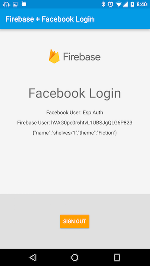

# Google Cloud Endpoints Firebase Android Client

This example is a fork of
[quickstart-android](https://github.com/firebase/quickstart-android/tree/master/auth)
Please see `makeEndpointsRequest()` in
`app/src/main/java/com/google/firebase/quickstart/auth/GoogleSignInActivity.java`
for how to make a request to an API managed by Google Cloud Endpoints.

## Prerequisites

* A device running Android 2.3 (Gingerbread) or newer, and Google Play services 9.0.1 or newer
* The Google Play services SDK from the Android SDK Manager
* Android Studio 1.5 or higher

## Set up your Firebase project

* Create a Firebase project in the Firebase
  [console](https://firebase.google.com/console/), if you don't
  already have one. If you already have an existing Google project
  associated with your mobile app, click Import Google
  Project. Otherwise, click Create New Project.

* Click Add Firebase to your Android app and follow the setup steps. If
  you're importing an existing Google project, this may happen
  automatically and you can just download the config file.

* When prompted, enter your app's package name
  (`com.google.firebase.quickstart.auth`). It's important to enter the
  package name your app is using; this can only be set when you add an
  app to your Firebase project.

* At the end, you'll download a GoogleService-Info.plist file. You can
  download this file again at any time.

* If you haven't done so already, copy this into your project's module
  folder, typically app/.

### Google Sign In Setup

- Go to the [Firebase Console](https://console.firebase.google.com) and navigate to your project:
  - Select the **Auth** panel and then click the **Sign In Method** tab.
  - Click **Google** and turn on the **Enable** switch, then click **Save**.
- Run the app on your device or emulator.
    - Select `GoogleSignInActivity` from the main screen.
    - Click the **Sign In** button to begin.

### Facebook Login Setup

- Go to the [Facebook Developers Site](https://developers.facebook.com) and follow all
  instructions to set up a new Android app. When asked for a package name, use
  `com.google.firebase.quickstart.usermanagement` and when asked for a main class name,
  use `com.google.firebase.quickstart.usermanagement.FacebookLoginActivity`.
- Go to the [Firebase Console](https://console.firebase.google.com) and navigate to your project:
  - Select the **Auth** panel and then click the **Sign In Method** tab.
  - Click **Facebook** and turn on the **Enable** switch, then click **Save**.
  - Enter your Facebook **App Id** and **App Secret** and click **Save**.
- Open the file `app/src/main/res/values/ids.xml` and replace the value of the `facebook_app_id` with the ID of the Facebook app you just created.
- Run the app on your device or emulator.
    - Select `FacebookLoginActivity` from the main screen.
    - Click the **Sign In** button to begin.
    - If you see text that says Facebook is disabled, make sure you are running
      either the `facebookDebug` or `facebookRelease` variants of this sample.

### Multiple Accounts Per Email Address

To allow users to create multiple accounts for authentication
providers that use the same email address.

- Go to the [Firebase Console](https://console.firebase.google.com)
  and navigate to your project:
  - Select the **Auth** panel and then click the **Sign In Method**
    tab.
  - In **Advanced** seciton, click **change**.
  - Select **Allow creation of multiple accounts with the same email
    address** and click **Save**.

## Deploy your backend

Replace the contents of `swagger.json` with the contents in
[examples/swagger/bookstore/swagger-firebase.json](/examples/swagger/bookstore/swagger-firebase.json)
in your backend directory.

In the Swagger file, make sure to correctly configure Firebase auth's
list of accepted audiences in the `audiences` property - add your
project ID to the list. You can find the project ID in
[Google cloud console](https://console.cloud.google.com).

You'll need a security segment in your Swagger file to enable Firebase
auth.  You can add the security segment to a specific method (by
adding it within the section for a specific HTTP path and verb), or to
the entire API (by adding it to the root Swagger document object):

    "x-security": [
      {
        "firebase": {
          "audiences": [
            "YOUR_PROJECT_ID"
          ]
        }
      }
    ]

You'll also need a Swagger `securityDefinitions` clause to define
Firebase as an authentication provider for your Google Cloud Endpoints
API.
[securityDefinitions](http://swagger.io/specification/#securityDefinitionsObject)
is a property of the root Swagger document object:

    "securityDefinitions": {
      "firebase": {
        "authorizationUrl": "",
        "flow": "implicit",
        "type": "oauth2",
        "x-issuer": "https://securetoken.google.com/YOUR_PROJECT_ID",
        "x-jwks_uri": "https://www.googleapis.com/service_accounts/v1/metadata/x509/securetoken@system.gserviceaccount.com"
      }
    }

Update the `host` property in the Swagger spec file, and deploy the backend.
Instructions vary depending on what programming language you are using.  For
example, the [Node.js Bookstore example](/examples/nodejs/bookstore) backend is
deployed using the `gcloud deploy` command:

    gcloud --project=YOUR_PROJECT_ID beta app deploy

## Call your backend from an Android client

* In `res/values/ids.xml`, update `facebook_app_id` with your Facebook application ID.
* Modify `app/src/main/java/com/google/firebase/quickstart/auth/GoogleSignInActivity.java`
    * Update the `API_URL` constant to the URL of API call.
* Modify `app/src/facebook/java/com/google/firebase/quickstart/auth/FacebookLoginActivity.java`
    * Update the `API_URL` constant to the URL of API call.
* Try out the Android client app:
    * In Android Studio: Run > Run 'app'.
    * Create or reuse an existing emulator.
    * The Android client app should start automatically. If not, open your App
      Drawer and select the Firebase Authentication app.
    * Select GoogleSignInActivity or FacebookLoginActivity.
    * Sign in.
    * The API call should happen immediately and you should see the successful
      response shown below the Firebase user.

NOTE: If the emulator doesn't work, use a real Android device.

Below is an example of the app after a successful request.

## Additional information

Additional information on Firebase quick-start app is available at
https://firebase.google.com/docs/android/setup
