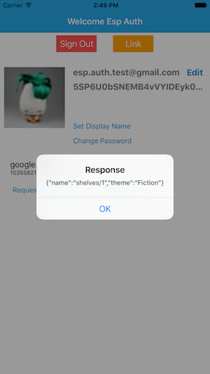

# Google Cloud Endpoints Firebase iOS Client

This example is a fork of
[quickstart-ios](https://github.com/firebase/quickstart-ios/tree/master/authentication).
Please see `makeEndpointsRequest()` in
`AuthenticationExample/MainViewController.m` for how to make a request
to an API managed by Google Cloud Endpoints.

In order to run the example you need to have [Xcode](https://developer.apple.com/xcode/)
installed.

## Set up your Firebase project

* Create a Firebase project in the Firebase
  [console](https://firebase.google.com/console/), if you don't
  already have one. If you already have an existing Google project
  associated with your mobile app, click Import Google
  Project. Otherwise, click Create New Project.

* Click Add Firebase to your iOS app and follow the setup steps. If
  you're importing an existing Google project, this may happen
  automatically and you can just download the config file.

* When prompted, enter your app's bundle ID
  (`com.google.firebase.quickstart.AuthenticationExample`). It's
  important to enter the bundle ID your app is using; this can only be
  set when you add an app to your Firebase project.

* At the end, you'll download a GoogleService-Info.plist file. You can
  download this file again at any time.

* If you haven't done so already, copy this into your Xcode project
  root.

### Google Sign In Setup
- Go to the [Firebase Console](https://console.firebase.google.com) and navigate to your project:
  - Select the **Auth** panel and then click the **Sign In Method** tab.
  - Click **Google** and turn on the **Enable** switch, then click **Save**.
- In XCode, add a custom URL scheme for your reversed client ID.
  - You can find this in the `GoogleService-Info.plist`

### Facebook Login Setup
- Go to the [Facebook Developers Site](https://developers.facebook.com) and follow all
  instructions to set up a new Android app. When asked for a bundle ID, use
  `com.google.firebase.quickstart.AuthenticationExample`.
- Go to the [Firebase Console](https://console.firebase.google.com) and navigate to your project:
  - Select the **Auth** panel and then click the **Sign In Method** tab.
  - Click **Facebook** and turn on the **Enable** switch, then click **Save**.
  - Enter your Facebook **App Id** and **App Secret** and click **Save**.
- Open your regular `Info.plist` and replace the value of the `FacebookAppID` with the ID of the
  Facebook app you just created, e.g 124567. Save that file.
- In the *Info* tab of your target settings add a *URL Type* with a *URL Scheme* of 'fb' + the ID
  of your Facebook app, e.g. fb1234567.

### Multiple Accounts Per Email Address

To allow users to create multiple accounts for authentication
providers that use the same email address.

- Go to the [Firebase Console](https://console.firebase.google.com)
  and navigate to your project:
  - Select the **Auth** panel and then click the **Sign In Method**
    tab.
  - In **Advanced** seciton, click **change**.
  - Select **Allow creation of multiple accounts with the same email
    address** and click **Save**.

## Deploy your backend

Replace the contents of `swagger.json` with the contents in
[examples/swagger/bookstore/swagger-firebase.json](/examples/swagger/bookstore/swagger-firebase.json)
in your backend directory.

In the Swagger file, make sure to correctly configure Firebase auth's
list of accepted audiences in the `audiences` property - add your
project ID to the list. You can find the project ID in
[Google cloud console](https://console.cloud.google.com).

You'll need a security segment in your Swagger file to enable Firebase
auth.  You can add the security segment to a specific method (by
adding it within the section for a specific HTTP path and verb), or to
the entire API (by adding it to the root Swagger document object):

    "x-security": [
      {
        "firebase": {
          "audiences": [
            "YOUR_PROJECT_ID"
          ]
        }
      }
    ]

You'll also need a Swagger `securityDefinitions` clause to define
Firebase as an authentication provider for your Google Cloud Endpoints
API.
[securityDefinitions](http://swagger.io/specification/#securityDefinitionsObject)
is a property of the root Swagger document object:

    "securityDefinitions": {
      "firebase": {
        "authorizationUrl": "",
        "flow": "implicit",
        "type": "oauth2",
        "x-issuer": "https://securetoken.google.com/YOUR_PROJECT_ID",
        "x-jwks_uri": "https://www.googleapis.com/service_accounts/v1/metadata/x509/securetoken@system.gserviceaccount.com"
      }
    }

Update the `host` property in the Swagger spec file, and deploy the backend.
Instructions vary depending on what programming language you are using.  For
example, the [Node.js Bookstore example](/examples/nodejs/bookstore) backend is
deployed using the `gcloud deploy` command:

    gcloud --project=YOUR_PROJECT_ID app deploy

## Call your backend from an iOS client

Make sure you have `pod` installed on your system (try running `pod install`).
If not, install it:

    sudo gem install cocoapods

Install project dependencies:

    pod install

Open `AuthenticationExample.xcworkspace` in Xcode (the easy way is to
run `open AuthenticationExample.xcworkspace`), and update `Info.plist` as stated in 
**Google Sign In Setup** and **Facebook Login Setup**.

Run the application in Xcode. In the iOS emulator, click "Sign in" and
select Google or Facebook. Upon successful sign-in, click the `Call
API` link and the iOS application will request the URL stored in
`SampleAPIBaseURL` and display the result of the call.

Below is an example of the app after a successful request.

## Additional information

Additional information on Firebase quick-start app is available at
https://firebase.google.com/docs/ios/setup
