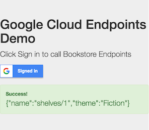

# Google Cloudendpoints ID Token Javascript Client

Please see `makeEndpointsRequest()` in `index.html`
for how to make a request to an API managed by Google Cloud Endpoints.

## Setting up the OAuth client ID

* Go to https://console.cloud.google.com
* Select an existing project. You can also create a project in [Google Developer
  Console](https://console.developers.google.com/project). The project
  you select can be the same as your backend project or a separate one.
* Navigate to Credentials page and create an OAuth client ID for web
  application. Add the URL to the `index.html` on your web server to the Authorized
  Javascript origins. You will use this client ID in the next step.
* Replace the content of google-signin-client_id in index.html with the client
  ID that was created in the previous step.

## Deploy your backend

Start Google Cloud Endpoints and the bookstore backend. The whole API surface,
or a specific method must be configured to accept Google ID Token auth.

Replace the `swagger.json` in your backend directory with
[examples/swagger/bookstore/swagger-google-id-token.json](/examples/swagger/bookstore/swagger-google-id-token.json).
The `swagger-google-id-token.json` configures the API to require authentication
via Google ID Token on the whole API surface.

In your Swagger file, make sure to correctly configure Google ID Token
list of accepted audiences in the `audiences` property - add your Client ID to
the list.

This segment enables Google ID token on a specific method (if applied
to a specific HTTP path and verb in your Swagger):

    "x-security": [
      {
        "google_id_token": {
          "audiences": [
            "YOUR_CLIENT_ID"
          ]
        }
      }
    ]

Use the Swagger `securityDefinitions` clause to define Google Id Token
as an authentication provider for your Google Cloud Endpoints API.
[securityDefinitions](http://swagger.io/specification/#securityDefinitionsObject)
is a property of the root Swagger document object:

    "securityDefinitions": {
      "google_id_token": {
        "authorizationUrl": "",
        "flow": "implicit",
        "type": "oauth2",
        "x-issuer": "https://accounts.google.com",
        "x-jwks_uri": "https://www.googleapis.com/oauth2/v1/certs"
      },
    }

If your API is hosted on a different domain than the enclosing page,
please make sure your backend handles
[CORS](https://en.wikipedia.org/wiki/Cross-origin_resource_sharing).

Deploy the backend. Instructions may vary depending on what programming language
you are using. For example, with Node.js Bookstore example backend, update
`host` property in the Swagger spec file, and run the `gcloud deploy` command:

    gcloud --project=YOUR_PROJECT_ID app deploy

## Running

Below is an example of the app after a successful request.

## Additional information

Additional information about Google Sign-In for web is available at
https://developers.google.com/identity/sign-in/web.
