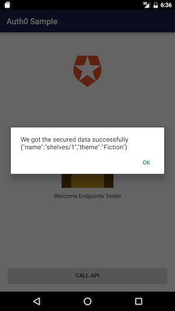

# Google Cloud Endpoints Auth0 Android Client

This is a fork of
[native-mobile-samples](https://github.com/auth0/native-mobile-samples/tree/b378ef05544d94ac5dda369ebb4102cd3dc9bbfa/Android/basic-sample).
Please see `onCreate()` and `callAPI()` in
`app/src/main/java/com/auth0/sample/ProfileActivity.java` for how to make
a request to Endpoints.

In order to run the example, you'll need to be familiar with how to deploy
the sample [Node.js app](/examples/nodejs/bookstore/README.md), found in
[examples/nodejs/bookstore](/examples/nodejs/bookstore).
See the [README](/examples/nodejs/bookstore/README.md) for more details.

## API Server configurations

Follow Initial Setup Instructions, Auth0 Symmetric key encryption Instructions
or Auth0 Asymmetric key encryption Instructions described in
[third_party/examples/client/auth0/README.md](/third_party/examples/client/auth0/README.md).

## Build and run your Android App

In order to run the example you need to have Android SDK and AVD manager
installed. We recommend installing
[Android Studio](http://developer.android.com/tools/studio/index.html).

1. Edit `app/src/main/java/com/auth0/sample/ProfileActivity.java`. Change
   `API_URL` variable to the address of your deployed backend application.
2. To support Facebook login, you need to register a Facebook app
   ID/secret, enable it for Android platform, and lastly configure it
   in Auth0 connections. Please see the following
   [link](https://auth0.com/docs/connections/social/facebook) for detailed
   instructions.
3. Update `app/src/main/res/values/auth0.xml` with your Auth0 clien ID, domain,
   and facebook App ID. `auth0_scheme` is `"a0" + lowercase(auth0_client_id)`.
4. Start an emulator from AVD manager.
5. Before the next step, make sure you export `$JAVA_HOME` (points to Java SDK)
   and `$ANDROID_HOME` (points to Android SDK).
6. Run the following commands. You may need to use the standalone
   Android SDK Manager (included in Android Studio) to install Android
   SDK 5.1.1 and Android SDK Build-tools 22.0.1.

    `bash ./gradlew installDebug && adb shell am start -n com.auth0.sample/.MainActivity`

7. Switch to your emulator to start sign in and make an authenticated request
   to Google Cloud Endpoints.

NOTE: If the emulator doesn't work, use a real Android device.

Below is an example of the app after a successful request.

