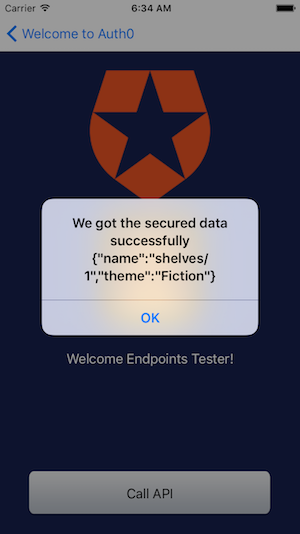

# Google Cloud Endpoints Auth0 iOS Client

This is a fork of
[native-mobile-samples](https://github.com/auth0/native-mobile-samples/tree/59f556ddb5741fd06c4aa792ec82c3a2f828b30e/iOS/basic-sample).
Please see callAPI() in `basic-sample/ProfileViewController.m` for how to make
a request to Endpoints.

In order to run the example, you'll need to be familiar with how to
deploy the sample
[Node.js app](/examples/nodejs/bookstore/README.md), found in
[examples/nodejs/bookstore](/examples/nodejs/bookstore).
See the [README](/examples/nodejs/bookstore/README.md) for more details.

## API Server configurations

Follow Initial Setup Instructions, Auth0 Symmetric key encryption Instructions
or Auth0 Asymmetric key encryption Instructions described in
[third_party/examples/client/auth0/README.md](/third_party/examples/client/auth0/README.md).

## Build and run your iOS App

In order to run the project, you need to have `XCode` installed. Once you have
that, install project dependencies and open the project workspace:

    sudo gem install cocoapods
    pod install
    open basic-sample.xcworkspace

To support Facebook login, you need to register a Facebook app
ID/secret, enable it for Android platform, and lastly configure it in
Auth0 connections. Please see this
[link](https://auth0.com/docs/connections/social/facebook) for
detailed instructions.

From the
[third_party/examples/client/auth0-ios](/third_party/examples/client/auth0-ios)
directory, edit [basic-sample/Info.plist](basic-sample/Info.plist).

1. Change `SampleAPIBaseURL` to the address of your deployed application.
2. Update `Auth0ClientId`, `Auth0Domain`, `FacebookAppID`,
   `FacebookDisplayName` (if applicable) fields with the values from your
   API's Auth0 dashboard.

Below is an example of the app after a successful request.

